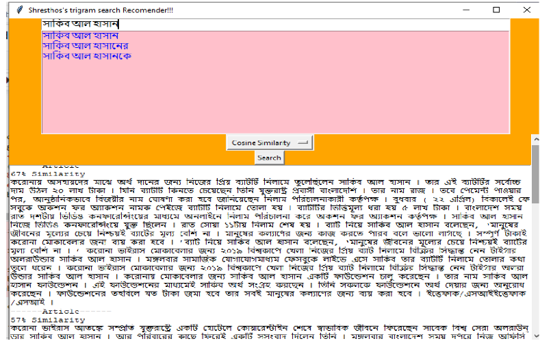
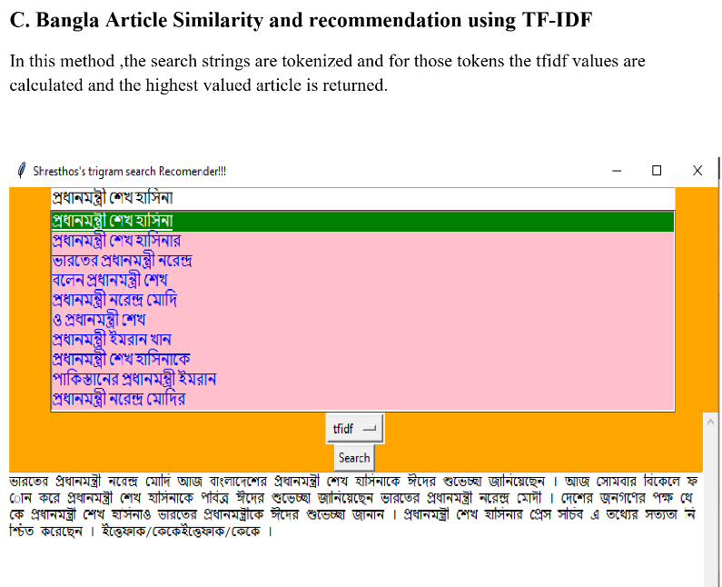
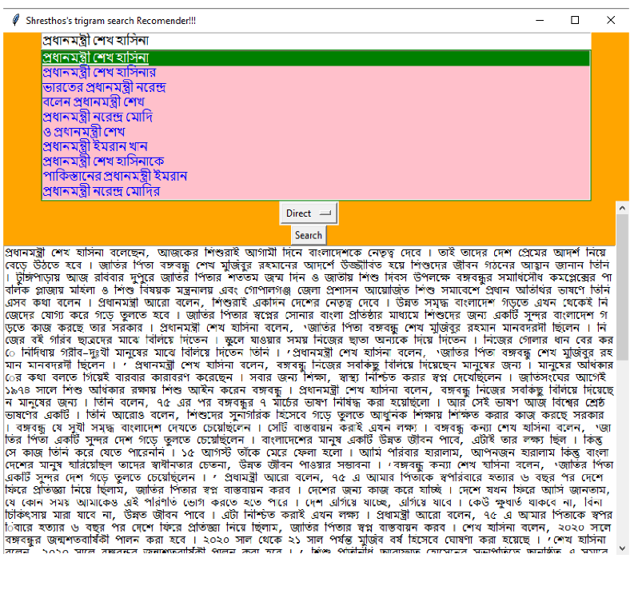

# 📚 Bangla-Article-Similarity-and-recommendation-using-Cosine-Similarity_2

This project implements a Bangla article similarity and recommendation system using **TF-IDF** and **Cosine Similarity**. It was built from scratch without using high-level machine learning libraries like `scikit-learn`.

> 🚀 The system can recommend the top relevant Bangla news articles based on a search query, leveraging a dataset of 50K+ articles from *The Daily Ittefaq*.

---

## 📰 Dataset Overview

- **Total Articles:** ~53,571  
- **Total Sentences:** ~900,000  
- **Unigrams:** 13,326,446  
- **Bigrams:** 13,579,033  
- **Trigrams:** 24,030,358  
- **Categories:** 22 (e.g., জাতীয়, রাজনীতি, ক্রীড়া, বিজ্ঞান ও প্রযুক্তি)

---

## 🧠 Methodology

The system involves several NLP pipeline steps:

### A. Preprocessing
- ✅ Bangla punctuation & Unicode cleaning  
- ✅ Duplicate sentence removal  
- ✅ Stopword filtering (`stopwords_bn.txt`)  
- ✅ Bangla stemming  
- ✅ Tokenization  
- ✅ Small article removal  

### B. Vectorization & Similarity
- **TF-IDF**: Custom implementation of Term Frequency-Inverse Document Frequency  
- **Cosine Similarity**: Measures similarity between article and query vectors

### C. Recommendation Logic
- Calculates cosine similarity between query and article vectors
- Returns top-K most similar article filenames

---

## 📸 Screenshot

